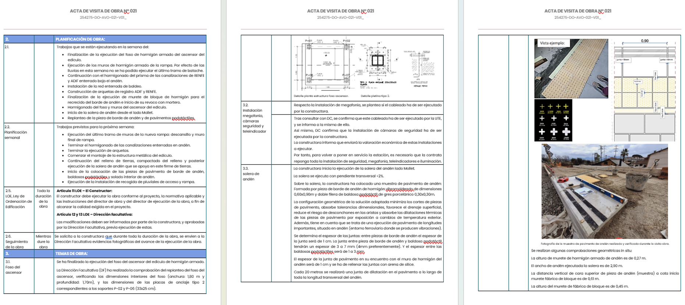
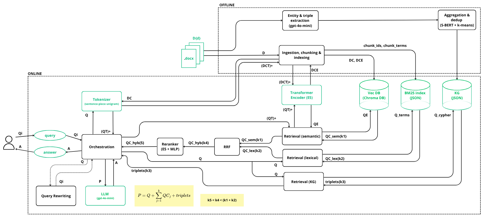
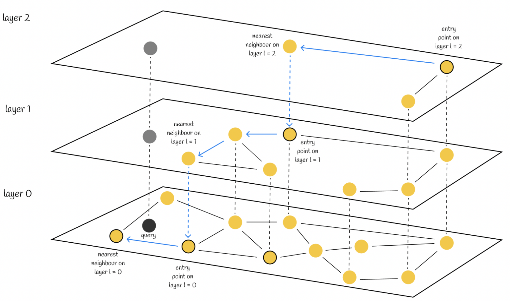
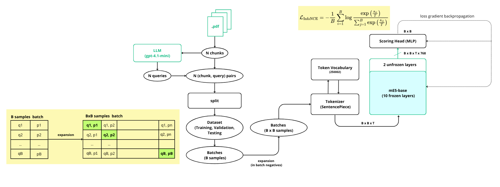
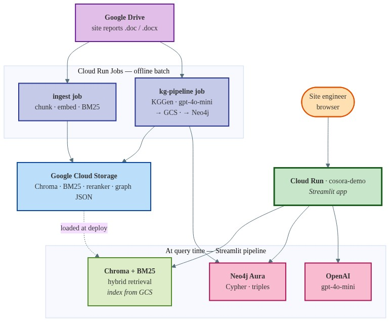
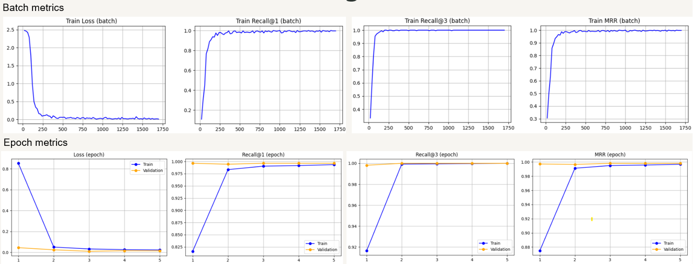

# RAG & Knowledge Graph over Construction Site Visit Reports

**Authors**

- Domínguez del Brío Tristán, Francisco Jose
- Muriel Puga, Yolanda
- Palma Garro, Jill Areny
- Rius i Vilaseca, Oriol

**Final project - UPCSchool** · [Repository](https://github.com/UriRius/RAG-UPCSchool-Project)

This project demonstrates how **Retrieval-Augmented Generation (RAG)** and **knowledge graph**
techniques extract and retrieve information from construction site visit reports (*"actas de obra"*),
enabling natural-language questions backed by the official documents.

# Table of Contents

1. [About the project](#1-about-the-project)
2. [System overview](#2-system-overview)
3. [System architecture](#3-system-architecture)
   - [Retrieval pipeline](#31-rag-retrieval-pipeline)
   - [Knowledge graph pipeline](#32-knowledge-graph-pipeline)
   - [GCP deployment](#33-gcp-deployment)
4. [How to run the code](#4-how-to-run-the-code)
   - [Run the demo locally](#44-run-the-demo-app-locally)
   - [Knowledge graph pipeline](#46-knowledge-graph-pipeline)
   - [Deploy to GCP](#47-deploy-to-gcp-optional)
5. [Experiments](#5-experiments)
   - [Retrieval](#51-retrieval-experiments)
   - [Knowledge graph](#52-knowledge-graph-experiments)
6. [Overall conclusions](#6-overall-conclusions)
7. [References](#7-references)
8. [Deliverables](#8-deliverables)

# 1. About the project

Construction projects generate large volumes of unstructured site visit reports documenting decisions, incidents, responsibilities, and progress. As these documents accumulate over the lifetime of a project, locating specific information becomes increasingly difficult. The proposed system enables users to access this information through natural language queries, removing the need to manually inspect large collections of reports.

<p align="center">
  <br>
  <em>Figure 1. Example of construction site visit report</em>
</p>

# 2. System overview

Retrieval-Augmented Generation (RAG) enhances Large Language Models (LLMs) by retrieving relevant information from external knowledge sources at inference time and incorporating it into the input context. By augmenting the model’s parametric knowledge with external data, RAG mitigates key limitations of LLMs, such as their lack of access to information beyond their training cutoff and their inability to leverage organization-specific knowledge.

In this work, we focus on the latter limitation by designing a RAG-based system capable of answering questions over construction site visit reports generated within a specific organization.

Traditional RAG systems rely on chunking documents and retrieving relevant passages using either semantic similarity (via dense vector embeddings) or lexical similarity (via keyword-based retrieval methods). In the proposed system, these complementary retrieval strategies are combined to produce a high-recall set of candidate chunks. This candidate set is subsequently refined by a cross-encoder reranking model, which is fine-tuned on query–chunk pairs derived from a corpus of construction-related documents. The reranker jointly encodes each query–chunk pair to estimate document relevance, selecting the most relevant chunks for answer generation.

In addition, the retrieval process is enriched with a **knowledge graph** automatically constructed from the same document collection, providing complementary structured knowledge. The reranked chunks, together with the graph-derived context, are finally supplied as context to the LLM to generate the response.

# 3. System architecture

<p align="center">
  <br>
  <em>Figure 2. System architecture</em>
</p>

## 3.1 RAG retrieval pipeline

The RAG pipeline is composed of five main modules or subsystems corresponding to the following stages: knowledge preparation, retrieval, reranking, response generation, and orchestration. These components are supported by a shared tokenization module that ensures consistent preprocessing across the pipeline.

- Ingestion, chunking and indexing
- Retrieval
- Reranking
- Response generation
- Orchestration

In addition to the core pipeline, a Query Rewriting module has been introduced to generate alternative query formulations using an LLM. This module enables systematic evaluation of how query reformulations affect retrieval effectiveness across multiple metrics, including recall and precision.

### Ingestion, chunking and indexing

The **Ingestion, Chunking, and Indexing** module is responsible for building the system's knowledge base by transforming the input documents into searchable representations for semantic and lexical retrieval.

Different chunking strategies were considered for document segmentation, including **character-based** chunking, which splits the text into fixed-size character sequences, **token-based** chunking, which divides the text into fixed-size token sequences, and **table row-based** chunking, where each chunk corresponds to the content of a single row. Since the visit reports are organized as tables, the final system adopts table row-based chunking, as each row naturally represents a coherent semantic unit of information. By leveraging this existing structure, the resulting chunks are more meaningful and self-contained, leading to higher-quality representations for retrieval.

Once the documents have been segmented, the resulting chunks are tokenized using the shared **Tokenizer Module** (based on SentencePiece), and encoded into dense vector embeddings using the encoder-only language model ([multilingual E5 base](https://huggingface.co/intfloat/multilingual-e5-base)).

The embeddings are then stored in the vector database ([Chroma](https://docs.trychroma.com/docs/overview/introduction)) to support semantic retrieval. Chroma uses an HNSW (Hierarchical Navigable Small World) graph-based index to efficiently perform approximate nearest neighbor (ANN) search, retrieving the _k_ nearest neighbors in the embedding space.

<p align="center">
  <br>
  <em>Figure 3. HNSW search algorithm</em>
</p>

The system also supports lexical retrieval based on the BM25 ranking function. As Chroma does not natively support BM25 indexing, the module constructs and stores a separate inverted index on disk. For each term $t_i$, the index stores its posting list, containing the identifiers of the indexed documents (i.e., chunks) in which the term appears together with the corresponding term frequencies, $TF(t_i,d)$. It also maintains the corpus-level statistics required by BM25, including the inverse document frequency, $IDF(t_i)$, the average document length, individual document lengths, and the BM25 parameters $(k_1,b)$, enabling efficient lexical retrieval and document ranking.

$$
\begin{aligned}
&t_i \in V \\
&TF(t_i,d)=\text{term frequency of } t_i \text{ in document } d \\
&DF(t_i)=|\{d \in DC : t_i \in d\}| \\
&IDF(t_i)=\log\left(1+\frac{|DC|-DF(t_i)+0.5}{DF(t_i)+0.5}\right) \\
&1.2 \leq k_1 \leq 2.0 \\
&0.3 \leq b \leq 0.9
\end{aligned}
$$

This module is demonstrated in `notebooks/chunking.ipynb` and `feature_extraction_and_indexing.ipynb`.

### Retrieval

The **Retrieval Subsystem** is responsible for retrieving pieces of the knowledge base (i.e., chunks) that form the relevant context for a given query.

It is composed of three modules: **Semantic Retrieval**, **Lexical Retrieval**, and **Rank Fusion** based on Reciprocal Rank Fusion (RRF), followed by a final reranking stage.

Information retrieval follows a hybrid paradigm that combines two complementary approaches: semantic and lexical retrieval. Semantic retrieval is a dense retrieval method that encodes both queries and documents into dense vector representations and retrieves relevant chunks based on vector similarity. By capturing semantic similarity beyond exact lexical overlap, it is particularly effective for paraphrases, synonyms, and semantically related expressions, typically improving recall. In contrast, lexical retrieval is a sparse retrieval method that operates over discrete terms in a bag-of-words representation, relying on exact term matching and term frequency statistics. This makes it particularly effective for queries containing technical terminology, named entities, or specific identifiers, often improving precision. These complementary properties motivate a hybrid retrieval strategy that balances recall and precision across diverse query types.

The **Semantic Retrieval** module encodes queries using the shared **Tokenizer Module** and the same encoder-only language model used for document embeddings. It performs similarity search over a vector database using an Approximate Nearest Neighbor (ANN) algorithm implemented via a Hierarchical Navigable Small World (HNSW) index, enabling efficient retrieval in high-dimensional embedding spaces while preserving high recall.

In parallel, the **Lexical Retrieval** module operates over a separate inverted index stored on disk, since the vector database (Chroma) does not natively support sparse retrieval. Given a query, retrieval is performed via exact term matching over query terms, and documents are ranked using the BM25 scoring function, which incorporates term frequency, inverse document frequency, and document length normalization.

The outputs of semantic and lexical retrieval are combined by the **Rank Fusion module**, which produces a unified ranking from both ranked lists. Two fusion strategies are considered: Reciprocal Rank Fusion (RRF) and Linear Score Fusion (LSF). RRF aggregates rankings based on the reciprocal of document ranks, while LSF combines normalized retrieval scores through a weighted linear combination. In this work, RRF is selected due to its simplicity, robustness, and independence from score normalization, making it particularly well-suited for heterogeneous retrieval signals.

$$
\begin{aligned}
&RRF = \frac{1}{R_{\text{semantic}}} + \frac{1}{R_{\text{lexical}}}\\
&LSF = \alpha S^N_{\text{sem}} + (1-\alpha) S^N_{\text{lex}}\, ; \qquad
S^N_{\text{sem}} = \frac{S_{\text{sem}}(D)-S^{\text{m}}_{\text{sem}}(D)}
{S^{\text{M}}_{\text{sem}}(D)-S^{\text{m}}_{\text{sem}}(D)}\, ; \qquad
S^N_{\text{lex}} = \frac{S_{\text{lex}}(D)-S^{\text{m}}_{\text{lex}}(D)}
{S^{\text{M}}_{\text{lex}}(D)-S^{\text{m}}_{\text{lex}}(D)}
\end{aligned}
$$

Finally, the top-_k_ chunks retrieved by the hybrid retrieval stage are passed to a reranking model trained to estimate query–document relevance. This reranking stage constitutes the final step of the Retrieval Subsystem and refines the initial ranking, improving precision and producing the final ordered set of chunks used as context for downstream generation.

This module is demonstrated in `hybrid_retrieval.ipynb`.

### Reranking

Although the hybrid retrieval stage efficiently identifies a set of potentially relevant candidate chunks, the similarity scores produced by dense and lexical retrieval provide only an indirect approximation of document relevance. Dense retrieval estimates relevance through embedding similarity, whereas lexical retrieval relies on exact term matching and BM25 scoring. While both approaches are highly effective for candidate generation, neither explicitly models the interactions between the query and the retrieved document. Consequently, the highest-ranked chunks are not always the most relevant ones for answering the user's query.

To address this limitation, the retrieved top-_k_ candidate chunks are passed to a cross-encoder reranker. Unlike bi-encoders, which encode queries and documents independently before comparing their vector representations, a cross-encoder jointly encodes the query and the document as a single input sequence. This allows the Transformer's attention mechanism to explicitly model interactions between tokens from both texts and directly estimate document relevance rather than approximating it through embedding similarity. As a result, cross-encoders typically produce substantially more accurate relevance estimates, making them the standard choice for the reranking stage of modern retrieval systems.

Although pretrained cross-encoders specifically designed for reranking, such as those of the BGE family, could have been adopted directly, this work instead constructs a task-specific reranker by extending the same multilingual E5 encoder used during the retrieval stage with an MLP scoring head. During fine-tuning, only the last two Transformer layers of the encoder and the scoring head are updated, while all remaining encoder parameters remain frozen. This design preserves architectural consistency across retrieval and reranking, allowing both stages to rely on the same multilingual semantic representations while adapting the model to the notion of relevance required by the target domain. At the same time, restricting training to a small subset of the parameters significantly reduces computational cost and the risk of overfitting, making the approach both efficient and well suited to domain-specific reranking.

Despite their superior ranking accuracy, cross-encoders are computationally too expensive to be applied directly to every document in the collection, as they require a complete forward pass for each query-document pair. For this reason, they are employed only after the hybrid retrieval stage has reduced the search space to a high-recall candidate set. The reranker then refines this candidate set and selects the highest-ranked _n_ chunks, which are ultimately provided to the language model as contextual evidence for answer generation. This two-stage architecture combines the scalability and recall of hybrid retrieval with the superior relevance estimation capabilities of cross-encoder reranking while keeping the computational cost manageable.

This module is demonstrated in `dataset_generation.ipynb` and `e5_reranker.ipynb`. In turn, the module is provided as a e5_reranker.py file so that the fine-tuned reranker can be imported in the application.

#### Reranker training

Since no manually annotated query–document relevance dataset was available for the target domain, a synthetic training corpus was constructed from a collection of construction-related documents. Chunks were first extracted from the documents, and for each chunk, `gpt-4o-mini` was prompted to generate a natural-language query whose answer could be found in that chunk. This procedure produced synthetic positive query–chunk pairs, where each query is aligned with its source chunk.

The resulting dataset was split into training, validation, and test sets. During training, the data was organized into mini-batches. Each batch was then augmented using an in-batch negatives strategy: for a given query, its corresponding chunk acts as the positive example, while all other chunks within the same batch are treated as negative candidates. This approach increases the number of effective negatives without requiring explicit negative sampling or additional annotation effort.

The reranker is trained using the **InfoNCE** loss, formulated over the relevance scores computed for all query–chunk pairs within each batch.

$$
L_ {\text{InfoNCE}}= \frac{-1}{N}\sum_{i=1}^{n}log\frac{\exp{\frac{s_{\text{ii}}}{T}}}{\sum_{i=1}^{n}\exp{\frac{s_{\text{ij}}}{T}}}
$$

The objective encourages the model to assign higher scores to positive pairs while suppressing scores for in-batch negatives, thereby learning a discriminative notion of relevance tailored to the target domain.

<p align="center">
  <br>
  <em>Figure 4. Reranker training</em>
</p>

## 3.2 Knowledge graph pipeline

A graph-based information-extraction methodology that turns unstructured reports into a structured
knowledge representation, following four stages:

1. **Document ingestion & preprocessing** — `.doc`/`.docx` → plain text (`python-docx`, `textract`).
2. **Entity extraction** — prompt-based extraction with a local LLM (Ollama + Gemma 3).
3. **Relation extraction** — a second prompt enforces strict `(entity1, relation, entity2)` triples.
4. **Graph construction & consolidation** — normalization, deduplication and state prioritization,
   stored both in-memory and as JSON.

The resulting graph is integrated into a **hybrid Graph-RAG retrieval system** (dense + sparse + graph),
where relevant triples are injected into the prompt as structured context, improving reasoning and
explainability. The graph can also be queried directly with **Cypher** (Neo4j), with an LLM translating
results into natural language:

```
User Question → Cypher Query → Graph Results → LLM → Natural-Language Answer
```

---

Graphs represent entities as nodes and the ways in which those entities relate to the world as relationships.

KGs consist of a set of subject-predicate-object triples and have become a fundamental data structure for information retrieval.

To solve this problem, we propose KGGen, a text-to-knowledge-graph generator that leverages Retrieval Augmented Generatin systems (RAG) and an algorithm for entity and edge resolution to extract high-quality, dense KGs from text. First, KGGen uses an LM-based extractor to read unstructured text and predict subject-predicate-object triples to capture entities and relations; after extracting the triples, it applies a novel, iterative clustering algorithm to refine the raw graph. Inspired by crowd-sourcing strategies for entity resolution, KGGen identifies nodes that refer to the same underlying entities, and consolidates edges that have equivalent meanings.

### Entity and relation extraction

The first stage takes unstructured text of construction site reports as input and produces an initial knowledge graph as extracted triples. We use a language model to provide structured output. The first step takes in source text and extracts a list of entities. Given the source text and entities list, the second step outputs a list of subject-predicate-object relations.

### Aggregation

After extracting triples from each source text, we collect all the unique entities and edges across all source graphs and combine them into a single graph. All entities and edges are normalized to be in lowercase letters only. The aggregation step reduces redundancy in the KG. Aggregation step does not require an LLM.

### Entity and edge resolution

After extraction and aggregation, it typically have a raw graph containing duplicate or synonymous entities and possibly redundant edges. The resolution stage merges nodes and edges representing the same real-world entity or concept. The resolution process employs a two-stage approach combining embedding-based clustering with LLMbased de-duplication to efficiently handle large knowledge graphs.

First, all items in the graph are clustered.

### Methodology

#### 1. Overview

This project follows a graph-based information extraction methodology designed to transform unstructured construction reports into a structured knowledge representation.
The approach consists of four main stages:

- Document ingestion
- Entity extraction
- Relation extraction
- Graph construction and consolidation

Each stage is supported by Language Models (LLMs) and rule-based post-processing to ensure consistency and quality of the resulting knowledge graph.

#### 2. Document ingestion and preprocessing

The input data consists of technical construction reports (actas and technical documents) in the docx formats.
Documents are processed using text extraction tools:

- python-docx for .docx
- textract for .doc
  The extracted content is converted into plain text, preserving as much structure as possible while removing formatting artifacts.
  To ensure efficiency and compatibility with LLMs, the text is truncated into manageable segments before further processing.

#### 3. Entity extraction

Entities are extracted using a prompt-based approach with a local Language Model (Ollama + Gemma 3).

A structured prompt is designed to enforce:

- Controlled output format (comma-separated list)
- Domain-specific entity types
- Short and normalized entity names

The LLM identifies relevant entities such as:

- construction elements
- organizations (e.g., UTE, DF)
- technical concepts
- actions and documentation

A post-processing step removes:

- duplicates
- noisy tokens
- invalid entity strings

This results in a clean set of entities representing the key concepts in each document.

#### 4. Relation extraction

Relationships between entities are extracted using a second LLM prompt.

The prompt enforces a strict triple format:
(entity1, relation, entity2)

Additionally:

- a predefined list of allowed relations is provided
- the number of candidate entities is limited to improve precision
- instructions prevent explanations or free text

The output is parsed using robust pattern matching to extract valid triples while filtering malformed responses.
This step produces the core knowledge representation used to build the graph.

#### 5. Normalization and deduplication

To improve graph quality, a normalization and deduplication process is applied:

##### Relation normalization

Semantically equivalent relations are unified:

- "realiza" → "ejecuta"
- "comienza" → "inicio"
- "termina" → "finalizado"

##### State prioritization

Special handling is applied to state-related relations (estado):

- conflicting states are resolved using priority rules
- the most advanced state (e.g., "finalizado") is retained

##### Duplicate removal

Triples are deduplicated using normalized keys:
(subject, relation, object)
This ensures that the graph remains consistent and avoids redundancy.

#### 6. Graph construction

The final graph is constructed as:

- a set of nodes (entities)
- a set of directed edges (relations)

Each triple is converted into:

`source → relation → target`

The resulting structure is stored in two formats:

##### 1. In-memory representation

Used for processing and querying

##### 2. JSON format

Exported for interoperability and visualization
This graph serves as the foundation for both retrieval and analytical tasks.

#### 7. Integration with retrieval pipeline

The constructed graph is integrated into a hybrid retrieval system:

- Dense retrieval (embeddings)
- Sparse retrieval (BM25)
- Graph-based retrieval (LLM over triples)

Graph-based retrieval selects the most relevant triples for a given query and injects them into the prompt as structured context.

This enhances the system by:

- improving reasoning
- adding explainability
- capturing relationships not present in raw text retrieval

#### 8. Summary

The methodology combines:

- unstructured document processing
- LLM-based information extraction
- hybrid retrieval strategies

This pipeline enables the transformation of construction reports into a reusable knowledge representation, supporting both semantic reasoning and analytical exploration.

### Graph-based analysis — content vs database usage

#### 1. Graph as content (semantic knowledge)

In this stage, the extracted knowledge graph is used as a semantic content source, where each triple represents a meaningful piece of information derived from construction reports.

The graph is composed of triples of the form:
(subject, relation, object)

These triples encode domain knowledge such as:

- incidents affecting construction elements
- pending actions
- technical issues described in the reports

For example:

(talud, estado, inestable)
(UTE, solicita, documentación técnica)
(acta AVO-03, contiene, incidencia)

To demonstrate the use of the graph as content, the system performs a filtering process over the triples to identify those that contain keywords related to incidents (e.g., “incidencia”, “problema”, “defecto”, “pendiente”, “incumplimiento”).
By aggregating these triples, it is possible to determine which reports (actas) contain the highest number of issues.

This approach does not rely on strict database queries, but instead on the semantic interpretation of triples, making it suitable for integration with Language Models (LLMs) in a Graph-RAG pipeline.

Additionally, the retrieved triples can be directly inspected to provide explainability, showing how specific conclusions are derived from the graph structure.

#### 2. Graph as database (structured querying)

In contrast, the knowledge graph can also be treated as a structured database, where nodes and relationships represent records that can be queried and aggregated.

In this scenario, the graph is used similarly to a relational database:

- entities correspond to records
- relations correspond to links between records
- triples can be processed as rows of structured data

To perform analytical queries, a filtering function is defined to identify which nodes correspond to construction reports (actas), typically based on naming patterns such as “AVO”, “ACTA”, or “DOB”.

Then, incident-related triples are counted per report, producing a structured aggregation:

Acta → Number of incidents

This enables:

- ranking reports by number of issues
- generating summary tables
- performing statistical analysis
- visualizing distributions of incidents

Unlike the Graph as Content approach, this method focuses on quantitative analysis, where the graph is treated as a dataset rather than a semantic knowledge source.

#### 3. Comparison of both approaches

The same knowledge graph supports two complementary paradigms:
Aspect Graph as Content Graph as Database
Purpose Semantic reasoning Quantitative analysis
Usage Context for LLMs Data aggregation
Output Relevant triples Numerical results
Interpretation Flexible, contextual Structured, deterministic
Role in pipeline RAG enhancement Analytical queries

This dual use demonstrates the versatility of the constructed knowledge graph:

- As content, it enhances language model reasoning by providing structured context
- As a database, it enables measurable insights and data-driven conclusions

#### 4. Conclusion

This experiment shows that a knowledge graph extracted from construction reports can serve both as:

- A semantic layer, supporting reasoning and contextual understanding in Graph-RAG systems.
- A data layer, supporting structured queries and statistical analysis.

The ability to switch between these two perspectives is a key advantage of graph-based systems, especially in domains where both qualitative interpretation and quantitative analysis are required.

### Querying graphs: Cypher. A graph query language

After constructing the Knowledge Graph from construction reports using LLM-based extraction, an additional querying layer was developed to enable interactive exploration of the graph.

This layer is based on Cypher, the query language of Neo4j, combined with a language model to generate human-readable answers.

Cypher is designed to be intuitive and expressive, allowing users to describe graph structures using patterns that closely resemble how graphs are visually represented. Instead of using tables and joins, Cypher relies on pattern matching over nodes and relationships.

The fundamental idea is to represent queries as graph patterns of the form:

`(node)-[relationship]->(node)`

This syntax directly reflects how entities are connected in the graph. For example, a relationship between a construction element and its state can be expressed as:

`(element)-[:ESTADO]->(state)`

Cypher queries are typically composed of two main clauses: MATCH and RETURN.

The MATCH clause is used to define the graph pattern to search for, while the RETURN clause specifies the data that should be retrieved.

For instance, a basic query in the construction domain could be:

```
MATCH (e)-[:ESTADO]->(s)
RETURN e.name, s.name
```

This query retrieves all elements and their associated states from the graph. Similarly, more specific queries can be defined using conditions:

```
MATCH (e)-[:ESTADO]->(s)
WHERE s.name CONTAINS "ejecución"
RETURN e.name
```

This allows us to identify elements that are currently in execution. Another example in the domain of construction reports is:

```
MATCH (o)-[:EJECUTA]->(a)
RETURN o.name, a.name
```

which retrieves which organizations execute which activities.

The philosophy behind Cypher follows the idea of “specification by example”, meaning that queries describe concrete patterns to match in the graph rather than abstract rules. This makes the query process highly intuitive and aligned with how humans understand relationships in real-world systems.

However, while Cypher provides structured outputs, these results are not directly suitable for non-technical users. To address this limitation, we integrate a language model that transforms graph query results into natural language.

The complete pipeline follows this structure:

User Question → Cypher Query → Graph Results → LLM → Natural Language Answer

For example, a user might ask:

¿Qué está en ejecución?

The corresponding Cypher query retrieves relevant triples from the graph, such as elements linked to the state “en ejecución”. These structured results are then passed to the language model, which generates a human-readable answer like:
“The slope and the foundation are currently under execution according to the construction reports.”
This approach enables the transformation of the graph into an interactive and user-friendly system. Cypher provides precise access to structured knowledge, while the language model ensures that the output is understandable and useful for end users.

As a result, the system supports both technical exploration and practical usage scenarios. It allows users to query construction knowledge, analyze relationships between elements, and obtain clear explanations without needing to understand graph query languages. The combination of Cypher and LLM-based generation therefore bridges the gap between structured data and human interpretation, making the Knowledge Graph a powerful tool for real-world decision support.

## 3.3 GCP deployment

The production demo runs **serverless on Google Cloud Platform** (`europe-west1`).

<p align="center">
  <br>
  <em>Figure 5. GCP deployment — offline jobs, GCS artifacts, Cloud Run demo</em>
</p>

**Offline (Cloud Run Jobs):**

| Job                 | Input                | Output                                                   |
| ------------------- | -------------------- | -------------------------------------------------------- |
| **ingest job**      | Site reports (Drive) | Chroma + BM25 + reranker → **GCS**                       |
| **kg-pipeline job** | Site reports (Drive) | KGGen extraction → graph JSON → **GCS** + **Neo4j Aura** |

**Online (Cloud Run service):** Streamlit demo loads the index from GCS and, at query time, runs hybrid retrieval (Chroma + BM25), Graph-RAG (Neo4j), and answer generation (OpenAI).

**Live demo:** https://cosora-demo-475080291256.europe-west1.run.app/

## 4. How to run the code

This section covers the **Streamlit demo**, local setup, data pipelines and **GCP deployment**.

**Live demo:** https://cosora-demo-475080291256.europe-west1.run.app/

### 4.1 Prerequisites

- **Python 3.10+**
- **OpenAI API key** — answer generation and Cypher LLM route
- **Prebuilt index (recommended)** — download Chroma + BM25 + reranker from GCS (see §4.4), or rebuild with `src/ingest.py`
- **Neo4j Aura** (optional) — required for Graph RAG modes (`cypher_transversal`); classic hybrid RAG works without it
- **GCP credentials** (optional) — for `download_db.py`, ingestion upload and Cloud Run deploy (`gcloud` CLI + service account / ADC)

### 4.2 Install dependencies

```bash
git clone https://github.com/UriRius/RAG-UPCSchool-Project.git
cd RAG-UPCSchool-Project

python -m venv .venv
# Windows
.venv\Scripts\activate
# macOS/Linux
source .venv/bin/activate

pip install -r requirements.txt
```

> `Requirements.txt` is kept as an alias of `requirements.txt` for backward compatibility.

### 4.3 Configure environment variables

Copy [`.env.example`](.env.example) to `.env` and fill in the values:

| Variable                      | Required for               | Description                                            |
| ----------------------------- | -------------------------- | ------------------------------------------------------ |
| `OPENAI_API_KEY`              | Demo                       | LLM generation                                         |
| `APP_PASSWORD`                | Demo                       | Password for the Streamlit login screen                |
| `GCP_BUCKET_NAME`             | Download / ingest / deploy | GCS bucket (`rag-actas-db-bucket` in production)       |
| `CHROMA_PATH`                 | Demo                       | Local path to ChromaDB (default `./data/chroma_db`)    |
| `CHROMA_COLLECTION`           | Demo                       | Override collection name (prod uses `cosora_actas_e5`) |
| `RR_MODEL_PATH`               | Demo                       | Fine-tuned E5 reranker (default `./rr_model`)          |
| `NEO4J_URI`, `NEO4J_PASSWORD` | Graph RAG                  | Neo4j Aura connection                                  |
| `DRIVE_FOLDER_ID`             | Ingestion / KG             | Google Drive folder with `.doc` / `.docx` actas        |

**Demo defaults** (match production Cloud Run):

```env
RAG_MODE=cypher_transversal
CYPHER_ROUTE=hybrid
EMBEDDING_STYLE=e5
RERANK_ENABLED=1
RETRIEVAL_K=50
TOP_N=10
RRF_K=60
```

`RAG_MODE` options: `v1`, `v2`, `v2_table` (classic hybrid RAG), `graph_baseline`, `cypher_transversal` (Graph RAG + Neo4j). See [src/rag/config.py](src/rag/config.py) for all knobs.

### 4.4 Run the demo app locally

```bash
# needs GCP_BUCKET_NAME in .env and authenticated gcloud / service account
python src/download_db.py

streamlit run src/app.py
```

`download_db.py` pulls `chroma_db/` and `rr_model/` from GCS into the paths in `.env`.

Open http://localhost:8501, enter `APP_PASSWORD`, and ask questions in Spanish. In the sidebar, confirm **Neo4j: Conectado** when using `cypher_transversal`. Expand **“Ver fuentes y trazabilidad”** to inspect acta chunks, Neo4j triples and Cypher.

### 4.5 Run the data ingestion (rebuild the index)

Rebuilds ChromaDB + BM25 from source actas. Requires `credentials.json` (service account with Drive read access) when using `--download-drive`.

```bash
# local docs already in data/raw/
python src/ingest.py --chunk-strategy both

# full Cloud Run Job flow: Drive → index → GCS
python src/ingest.py --download-drive --upload-db --chunk-strategy both
```

| Flag                    | Effect                                                                    |
| ----------------------- | ------------------------------------------------------------------------- |
| `--download-drive`      | Fetch `.doc` / `.docx` from `DRIVE_FOLDER_ID`                             |
| `--download-raw`        | Fetch raw docs from GCS instead of Drive                                  |
| `--upload-db`           | Upload `chroma_db/` to `GCP_BUCKET_NAME`                                  |
| `--chunk-strategy both` | Build `cosora_actas_e5` (recursive) + `cosora_actas_e5_v2` (table hybrid) |

Cloud Run Job equivalent: [deploy/scripts/deploy_job.ps1](deploy/scripts/deploy_job.ps1).

### 4.6 Knowledge graph pipeline

The **`kg-pipeline` Cloud Run Job** reads actas from Drive, runs **KGGen** (`kg-gen` + **gpt-4o-mini**) per Chroma chunk, writes graph JSON to **GCS**, and loads **Neo4j Aura** in the same run. See [§3.3 GCP deployment](#33-gcp-deployment).

### 4.7 Deploy to GCP (optional)

Serverless stack: **Cloud Build** → **Container Registry** → **Cloud Run** (demo) / **Cloud Run Jobs** (batch).

| Script                                                         | What it deploys                                                                 |
| -------------------------------------------------------------- | ------------------------------------------------------------------------------- |
| [deploy/scripts/deploy.ps1](deploy/scripts/deploy.ps1)         | Streamlit demo (`cosora-demo`) on Cloud Run (8 GiB RAM, 4 vCPU, `europe-west1`) |
| [deploy/scripts/deploy_job.ps1](deploy/scripts/deploy_job.ps1) | Ingestion job (`cosora-ingest-job`): Drive → Chroma → GCS                       |
| `kg-pipeline job`                                              | KGGen extraction → GCS + Neo4j (see §3.3)                                       |

**Deploy the web app** (from repo root, with `.env` containing `OPENAI_API_KEY`, `APP_PASSWORD`, `NEO4J_URI`, `NEO4J_PASSWORD`):

```powershell
.\deploy\scripts\deploy.ps1
```

Cloud Build ([deploy/cloudbuild.yaml](deploy/cloudbuild.yaml)) downloads `chroma_db/` and `rr_model/` from GCS, bakes them into the Docker image together with `intfloat/multilingual-e5-base`, and pushes `gcr.io/<PROJECT_ID>/cosora-demo`.

**Run ingestion manually after deploy:**

```powershell
gcloud run jobs execute cosora-ingest-job --region europe-west1 --wait
```

See [§3.3 GCP deployment](#33-gcp-deployment) for the architecture diagram.

### 4.8 Run the experiment notebooks

The experiments live in [notebooks/experiments/](notebooks/experiments/). Open them with Jupyter:

```bash
pip install jupyter
jupyter notebook notebooks/experiments/
```

Key notebooks (v2):

| Topic                          | Notebook                                                                                         |
| ------------------------------ | ------------------------------------------------------------------------------------------------ |
| Query rewriting (mrBERT vs E5) | [query_pipeline_with_query_mod.ipynb](notebooks/experiments/query_pipeline_with_query_mod.ipynb) |
| E5 reranker fine-tuning        | [e5_reranker.ipynb](notebooks/e5_reranker.ipynb)                                                 |
| KG extraction (v2)             | [kg_ingest_v2.ipynb](notebooks/experiments/kg_ingest_v2.ipynb)                                   |
| Neo4j Graph-RAG (v2)           | [neo4j_graph_rag_v2.ipynb](notebooks/experiments/neo4j_graph_rag_v2.ipynb)                       |

# 5. Experiments

Each experiment is documented with **Hypothesis**, **Setup**, **Results** and **Conclusions**.

## 5.1 Retrieval experiments

### Experiment 1 — Choosing the embedding model

**Hypothesis.** Two Spanish/multilingual embedding models (`mrBERT` and `e5`) will differ in retrieval
quality on the same query test set; we expect one to retrieve more relevant chunks than the other.

**Setup.**

- Backends: 2 (`mrBERT`, `e5`)
- Queries: 8 (shared test set)
- Top-K: 5
- Metrics: RRF scores, unique docs in top-K, corpus coverage, latency.

**Results.**

| Backend | avg_top1_rrf | avg_mean_rrf | avg_unique_docs@K | corpus_coverage | avg_latency_ms |
| ------- | ------------ | ------------ | ----------------- | --------------- | -------------- |
| mrBERT  | 0.025854     | 0.022785     | 4.375             | 26              | **2010.87**    |
| e5      | **0.032325** | **0.029888** | 3.375             | 26              | 6483.19        |

Per-query detail:

| #   | Query                                           | overlap_chunks@5 | overlap_docs@5 | mrbert_top1 | e5_top1  |
| --- | ----------------------------------------------- | ---------------- | -------------- | ----------- | -------- |
| 0   | ¿Qué se decidió sobre el talud?                 | 0.0              | 0.000          | 0.024924    | 0.033333 |
| 1   | ¿Cuál es el estado del camino provisional?      | 0.0              | 0.250          | 0.022436    | 0.033333 |
| 2   | ¿Qué incidencias AR-29 aparecen?                | 0.0              | 0.125          | 0.024348    | 0.030092 |
| 3   | ¿Cuáles son las incidencias más frecuentes…?    | 0.0              | 0.333          | 0.027418    | 0.030366 |
| 4   | ¿Qué responsable está asignado a las acciones…? | 0.0              | 0.167          | 0.021775    | 0.033060 |
| 5   | ¿Qué se acordó sobre hormigonado de zapatas?    | 0.2              | 0.200          | 0.027390    | 0.032018 |
| 6   | Estado de las instalaciones de megafonía        | 0.4              | 0.400          | 0.029877    | 0.033060 |
| 7   | ¿Qué documentación debe aportar la UTE sobre…?  | 0.0              | 0.600          | 0.028665    | 0.033333 |

**Conclusions.** **E5 wins.** `e5` produces higher RRF scores on _every_ query (top-1 and mean),
indicating stronger ranking confidence. `mrBERT` is ~3× faster (≈2.0 s vs ≈6.5 s) and surfaces slightly
more unique documents, but at lower relevance. Both cover the same 26 unique chunks, and their results are
largely disjoint (low overlap@5), confirming they rank by different signals. `e5`'s richer semantic
embedding space captures meaning beyond exact keyword matches; its higher latency is an acceptable
trade-off, so it was selected as the production embedding model. _This leads naturally to Experiment 2:
does query rewriting further improve the chosen model?_

### Experiment 2 — Query rewriting

**Hypothesis.** Generating semantic variants of the user query with an LLM (`gpt-4o-mini`, 3 variants
fused via RRF) will retrieve more relevant chunks than the original query alone. We expect the effect to
depend on the backend.

**Setup.**

- Backends: 2 (`mrBERT`, `e5`)
- Queries: 8 · Top-K: 5
- Rewriting: 3 `gpt-4o-mini` semantic variants per query, fused with the original via second-level RRF.
- Evaluation: **LLM-as-judge** (`gpt-4o-mini`), relevance scale 0–3.
- Metrics: Precision@5, NDCG@5, MRR, MAP.
- Notebook: [query_pipeline_with_query_mod.ipynb](notebooks/experiments/query_pipeline_with_query_mod.ipynb)

**Results.**

Aggregate — Original vs Rewritten per backend:

| Metric      | mrBERT orig | mrBERT rew | Δ          | e5 orig | e5 rew    | Δ          |
| ----------- | ----------- | ---------- | ---------- | ------- | --------- | ---------- |
| Precision@5 | 0.525       | 0.450      | **−0.075** | 0.700   | **0.775** | **+0.075** |
| NDCG@5      | 0.744       | 0.718      | −0.026     | 0.880   | **0.922** | +0.042     |
| MRR         | 0.750       | 0.629      | −0.121     | 0.838   | **0.917** | +0.079     |
| MAP         | 0.724       | 0.628      | −0.096     | 0.860   | **0.921** | +0.061     |

Per-query detail (**e5**, original → rewritten):

| #   | Query                                           | ΔP@5       | ΔNDCG@5    | ΔMRR       | ΔMAP       |
| --- | ----------------------------------------------- | ---------- | ---------- | ---------- | ---------- |
| 0   | ¿Qué se decidió sobre el talud?                 | +0.000     | −0.009     | +0.000     | −0.050     |
| 1   | ¿Cuál es el estado del camino provisional?      | +0.000     | −0.035     | +0.000     | +0.000     |
| 2   | ¿Qué incidencias AR-29 aparecen?                | +0.000     | +0.000     | +0.000     | +0.000     |
| 3   | ¿Cuáles son las incidencias más frecuentes…?    | **+0.200** | **+0.184** | **+0.133** | **+0.217** |
| 4   | ¿Qué responsable está asignado a las acciones…? | +0.000     | +0.000     | +0.000     | +0.000     |
| 5   | ¿Qué se acordó sobre hormigonado de zapatas?    | **+0.200** | **+0.239** | **+0.500** | **+0.321** |
| 6   | Estado de las instalaciones de megafonía        | +0.000     | −0.044     | +0.000     | +0.000     |
| 7   | ¿Qué documentación debe aportar la UTE…?        | **+0.200** | +0.000     | +0.000     | +0.000     |

**Conclusions.** **E5 + Rewriting is the winning configuration**, with consistent gains and no severe
degradations. Two clear patterns emerge:

- **`e5` is robust to rewriting.** When it already works well, rewriting doesn't break it; when it fails,
  rewriting fixes it (e.g. Q5 MRR 0.5 → 1.0). The GPT variants explore neighboring regions of the same
  semantic space, adding useful signal.
- **`mrBERT` is fragile to rewriting.** When it already retrieves perfectly (MRR = 1.0), the extra queries
  inject chunks from other documents that displace the correct chunk in the second-level RRF (e.g. Q6 MRR
  1.0 → 0.2). As a morphological model, it gains no new terminology from rewriting — only dilution.

The most vague query (Q3, _"incidencias más frecuentes"_) is the only one where **both** backends improve,
because the original query lacks enough signal. _This raises a new hypothesis: can a cross-encoder reranker
recover precision after retrieval? → Experiment 3._

### Experiment 3 — Reranking with a trained cross-encoder

#### Setup

The reranking model is built on top of a [Multilingual E5 base](https://huggingface.co/intfloat/multilingual-e5-base)) encoder, extended with a trainable MLP scoring head to enable joint query–document scoring in a cross-encoder-style architecture. The model is fine-tuned using a contrastive learning objective based on the InfoNCE loss, leveraging in-batch negatives to improve discrimination between relevant and non-relevant pairs.

The training dataset is synthetically constructed from a corpus of construction-related documents. For each extracted document chunk, an LLM (gpt-4o-mini) is prompted to generate a natural-language query whose answer is contained within the chunk. This process yields aligned query–document pairs that serve as positive training examples.

#### Dataset summary:

- Epochs: 10
- Early stopping: enabled with patience 2
- Batch size: 12
- Train samples 4264
- Validation samples: 533
- Test samples: 533

#### Training results

<p align="center">
  <br>
</p>

#### Test Results

- Loss: 0.0039
- Recall@1: 1.000
- Recall@3: 1.000
- MRR: 1.000

#### Conclusions

The reranking model achieves near-perfect performance on the synthetic evaluation benchmark, indicating that the current test distribution is not sufficiently challenging to reliably assess generalization. In particular, the absence of hard negatives—i.e., non-relevant passages that are semantically similar to the positive examples and therefore difficult to distinguish—likely leads to an overestimation of retrieval performance. Future work should incorporate such hard negatives to improve the robustness and discriminative capability of the model under more realistic retrieval conditions.

---

## 5.2 Knowledge graph experiments

### Experiment 4 — Entity & relation extraction (Pprompting strategy)

**Hypothesis.** A **structured prompt** (controlled output format, domain-specific entity types, allowed
relation list) extracts higher-quality and more consistent entities/relations than a **general prompt**.

**Setup.**

- 60 construction reports processed.
- Local LLM (Ollama + Gemma 3) for prompt-based extraction.
- Strict triple format `(entity1, relation, entity2)` with a predefined relation list.
- Robust pattern matching to parse and filter malformed responses.

**Results.**

| Metric                           | General Prompt | Structured Prompt (ours) |
| -------------------------------- | -------------- | ------------------------ |
| Documents processed              | 60             | 60                       |
| Total entities (unique)          | 80–100         | **150**                  |
| Entity quality                   | Medium         | **High**                 |
| Entity consistency               | Low            | **High**                 |
| Entity noise                     | High           | Medium                   |
| Raw relations (LLM output)       | 40–80          | **275**                  |
| Valid parsed relations           | 20–40          | **150–200**              |
| Final relations (after cleaning) | 20–30          | **50–80**                |
| Relation diversity               | Low            | **High**                 |
| Graph structure                  | Weak           | **Strong**               |

**Conclusions.** Structured prompting transforms the LLM from a _text generator_ into a _controlled
knowledge-extraction system_. The improvement is not only in quantity, but in the **structure and
consistency** of the extracted knowledge — producing a far more usable graph.

### Experiment 5 — Graph processing pipeline (normalization & deduplication)

**Hypothesis.** Parsing, cleaning, normalization and deduplication will reduce the raw triple count while
_increasing_ graph quality (less redundancy and noise) — i.e. consolidation, not data loss.

**Setup.** Five-stage pipeline applied to the raw LLM output. Relation normalization unifies synonyms
(`realiza` → `ejecuta`, `comienza` → `inicio`, `termina` → `finalizado`); state prioritization resolves
conflicting `estado` relations (most advanced state wins); duplicate triples removed by normalized
`(subject, relation, object)` key.

**Results.**

| Stage                       | Relations | Description                                                   |
| --------------------------- | --------- | ------------------------------------------------------------- |
| Raw LLM output              | **295**   | All triples, incl. duplicates, noise and variations           |
| After parsing               | **200**   | Only valid `(e1, relation, e2)` triples                       |
| After cleaning              | **150**   | Noisy entities / invalid text / low-quality relations removed |
| After normalization         | **120**   | Similar relations merged                                      |
| After deduplication (final) | **50–80** | Duplicates removed, states consolidated                       |

**Conclusions.** The relation count drops sharply across stages because the pipeline prioritizes
**quality over quantity**. Deduplication is **knowledge consolidation, not information loss**, yielding a
cleaner and more reliable graph.

### Experiment 6 — Graph QA: Cypher queries (content vs database)

**Hypothesis.** The same Knowledge Graph can serve two complementary roles — as **semantic content**
(context for LLM reasoning) and as a **structured database** (analytical counting/ranking) — and each
role suits different question types.

**Setup.** Cypher (Neo4j) queries over the graph, with an LLM (Gemma via Ollama) translating results into
natural language. Example pipeline:

```cypher
MATCH (n)-[r]->(m)
WHERE type(r) IN ["EJECUTA", "INICIA", "FINALIZA", "INSTALA", "DESMONTA"]
RETURN m.name AS actividad, count(*) AS frecuencia
ORDER BY frecuencia DESC
LIMIT 10
```

The structured result (e.g. `instalación de chapa → 3`, `andamiaje → 3`, `talud → 2`, …) is passed to the
LLM, which generates a human-readable summary of the most frequent activities.

**Results.** Suitability of each paradigm by question type:

| Question Type                          | Graph as Content (Semantic) | Graph as Database (Analytical) |
| -------------------------------------- | --------------------------- | ------------------------------ |
| Construction elements (most frequent)  | Good                        | Good (counts)                  |
| Construction process / activities      | Good                        | Good (counts)                  |
| Work relationships (connections)       | Partial                     | N/A                            |
| Dependencies (most frequent relations) | Good                        | Good (counts)                  |
| Health & safety factors                | Good                        | Limited                        |
| Safety relations                       | Good                        | Limited                        |
| Safety measures (which & why)          | Partial                     | N/A                            |
| Occupational risks                     | Partial                     | N/A                            |
| Incidents (problems & connections)     | Good                        | Good (counts)                  |
| Contractor (UTE) activities            | Good                        | Good (counts)                  |
| Technical impact of defects            | Good                        | Not measurable                 |
| Documentation impact (complex)         | Weak                        | Not supported                  |

**Conclusions.** The two paradigms are **complementary**: semantic queries excel at _understanding
relationships_, analytical queries at _counting and ranking_. Graph-QA performance depends on the question
type (semantic reasoning vs. quantitative analysis), and combining both — plus an LLM to verbalize results
— bridges structured data and human interpretation, enabling non-technical users to query the graph.

# 6. Overall conclusions

- **Retrieval:** `e5` is the better embedding model, and **`e5 + query rewriting`** is the best validated
  configuration — consistent gains with no severe degradation. `mrBERT` is faster but fragile to rewriting.
  Cross-encoder reranking is the next lever under evaluation.
- **Knowledge Graph:** **Structured prompting** is decisive — it turns the LLM into a controlled extractor,
  producing a denser, more consistent graph. The **processing pipeline** consolidates knowledge rather than
  losing it, and the graph supports both **semantic** and **analytical** querying via Cypher + LLM.
- **Together**, the KG transforms the system from a simple text-retrieval tool into a structured reasoning
  system, enabling more precise, explainable and domain-aware question answering. This first graph is small;
  the natural next step is to build a larger graph over the full corpus.

# 7. References

**Papers**

- _KGGen: Extracting Knowledge Graphs from Plain Text with Language Models_ — Mo et al., arXiv:2502.09956 [cs.CL]
- _Retrieval-Augmented Generation with Graphs (GraphRAG)_ — Han et al., 2024, arXiv:2501.00309
- _Unifying Large Language Models and Knowledge Graphs: A Roadmap_ — Pan et al., 2023, arXiv:2306.08302
- _HybGRAG: Hybrid Retrieval-Augmented Generation on Textual and Relational Knowledge Bases_ — Lee et al., 2024, arXiv:2412.16311
- _GraphER: A Structure-aware Text-to-Graph Model for Entity and Relation Extraction_ — Zaratiana et al., 2024, arXiv:2404.12491
- _G-Retriever: Retrieval-Augmented Generation for Textual Graph Understanding and QA_ — He et al., 2024, arXiv:2402.07630

**Courses & tools**

- DeepLearning.AI — [Knowledge Graphs for RAG](https://www.deeplearning.ai/courses/knowledge-graphs-rag)
- [Stanford Open Information Extraction (OpenIE)](https://nlp.stanford.edu/software/openie.html)
- Microsoft GraphRAG — [project](https://www.microsoft.com/en-us/research/project/graphrag/) · [docs](https://microsoft.github.io/graphrag/) · [GitHub](https://github.com/microsoft/graphrag)
- Visual graph tools — [yEd Live](https://www.yworks.com/yed-live/) · [Kumu](https://kumu.io/) · [Gephi Lite](https://lite.gephi.org/) · [Cosmograph](https://cosmograph.app/)

---

## 8. Deliverables

- **Final Report:** this README (the official Final Report of the project).
- **Slides:** submitted as an official deliverable. The presentation's front slide links to this
  repository: https://github.com/UriRius/RAG-UPCSchool-Project
- **Note:** per the assignment rules, code alone (even well documented) and the slides do **not** count as
  the Final Report — this README does.
